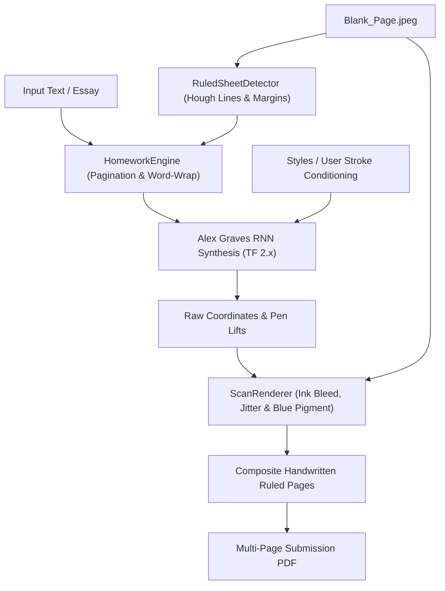

# 📝 Homework-Bud
> **Personalized Handwriting Synthesis on Real Ruled Notebook Sheets**  
> An end-to-end deep learning system that turns digital text and long-form essays into hyper-realistic handwritten assignments on photos or scans of real lined paper.

---

## 🌟 Overview

**Homework-Bud** adapts and extends Alex Graves' seminal handwriting synthesis recurrent neural network ([*Generating Sequences with Recurrent Neural Networks*](https://arxiv.org/abs/1308.0850)) into a production-ready assignment generator:

1. **Modernized RNN Engine**: Fully modernized for **TensorFlow 2.x** with all legacy `tf.contrib` dependencies eliminated, supporting both CPU and GPU execution.
2. **Ruled Sheet Detection (`ruled_sheet_detector.py`)**: Uses computer vision (Hough line transforms, projection profiles, and contour analysis) to detect baseline positions, line heights, and margin boundaries directly from photos of notebook pages (e.g., [`Blank_Page.jpeg`](Blank_Page.jpeg)).
3. **Realistic Ink Simulation (`scan_renderer.py`)**: Simulates realistic ballpoint and gel pen strokes (including authentic Royal Blue ink pigments, micro-jitter, velocity-dependent stroke thickness, and realistic alpha-blending onto paper textures).
4. **Personal Style Extraction & Fine-Tuning (`line_segmenter.py`, `finetune_user.py`)**: Slices photographs of user handwriting into individual lines, aligns them with verified ground-truth transcriptions ([`lines_transcription.csv`](lines_transcription.csv)), extracts vector strokes, and fine-tunes the RNN model to mimic personal handwriting.
5. **Multi-Page Essay Compilation (`homework_engine.py`)**: Word-wraps long essays across page boundaries, synthesizes strokes line-by-line, and compiles high-resolution multi-page PDF assignments.
6. **Turnkey Kaggle Integration (`kaggle/`)**: Pre-configured kernels and automated builders for training and multi-page generation on Kaggle GPUs.

---

## 📁 Repository Structure

```
homework-bud/
├── Blank_Page.jpeg               # Default high-res photo of blank ruled notebook paper
├── lines_transcription.csv       # Verified line transcriptions for user handwriting training
├── pyproject.toml                # Project metadata and dependencies
├── requirements.txt              # Pip requirements
│
├── checkpoints/                  # Pretrained Graves RNN weights (model-17900)
├── styles/                       # Pretrained style vectors (styles 0-12 and user style)
├── data/                         # Data utilities and IAM character blacklists
├── img/                          # Banner and documentation assets
│
├── Core Handwriting Synthesis (Graves RNN TF 2.x):
│   ├── demo.py                   # High-level Hand synthesis interface
│   ├── drawing.py                # Stroke tokenization, encoding & SVG rendering
│   ├── rnn.py                    # Graves RNN architecture with soft window attention & GMM loss
│   ├── rnn_cell.py               # Custom LSTM & Mixture Density Network cells
│   ├── rnn_ops.py                # GMM ops and parameter extraction
│   ├── tf_base_model.py          # TensorFlow model wrapper and training loop
│   ├── tf_utils.py               # Session and checkpoint utilities
│   ├── data_frame.py             # Batch data feeder
│   └── lyrics.py                 # Original demo lyrics
│
├── Homework-Bud Pipeline:
│   ├── homework_engine.py        # Central orchestrator: pagination, synthesis, and PDF compilation
│   ├── ruled_sheet_detector.py   # CV detector for page lines, line heights, and margins
│   ├── scan_renderer.py          # Ink texture simulation, stroke jitter, paper blending
│   ├── line_segmenter.py         # Slices user handwriting photos into line crops
│   ├── paper_stroke_extractor.py # Vector stroke skeletonizer from image crops
│   ├── build_dataset_verified.py # Generates stroke .npy dataset from verified transcriptions
│   ├── build_dataset_ocr.py      # TrOCR neural OCR dataset builder
│   ├── finetune_user.py          # Fine-tunes pretrained model on user handwriting
│   └── extract_style.py          # Extracts style conditioning vectors from user samples
│
└── kaggle/                       # Kaggle GPU workflows & pipelines
    ├── README.md                 # Kaggle workflow documentation
    ├── builders/                 # Generators for Kaggle Jupyter notebooks
    │   ├── build_kaggle_notebook.py
    │   ├── build_generator_notebook.py
    │   ├── build_original_style_notebook.py
    │   └── build_all.py          # Regenerates all Kaggle notebooks
    ├── kernels/                  # Self-contained Kaggle kernels
    │   ├── finetune/             # Model fine-tuning notebook & metadata
    │   ├── essay_generator/      # 1,000+ word essay generator notebook & metadata
    │   └── style6_generator/     # Style 6 maximum-legibility notebook & metadata
    └── dataset/                  # Kaggle dataset management
        ├── dataset-metadata.json # Dataset metadata for sujaykid/homework-bud-data
        └── stage_dataset.py      # Script to stage dataset bundle for upload
```

---

## 🚀 Quickstart

### 1. Installation

Create a virtual environment and install the required dependencies:

```bash
# Using uv (recommended)
uv venv
source .venv/bin/activate
uv pip install -r requirements.txt

# Or using standard pip
python3 -m venv .venv
source .venv/bin/activate
pip install -r requirements.txt
```

### 2. Generating Handwritten Assignments Locally

```python
from homework_engine import HomeworkEngine

# Initialize the homework engine (loads base model-17900 checkpoint)
engine = HomeworkEngine(
    checkpoint_dir="checkpoints",
    styles_dir="styles"
)

essay_text = """
The Impact of Artificial Intelligence on Modern Society

Artificial intelligence has rapidly transitioned from a theoretical concept
into an integral force shaping every facet of our everyday lives. From autonomous
transportation to advanced medical diagnostics, machine learning models are augmenting
human capabilities at an unprecedented rate.

As we look toward the future, the responsible development of ethical AI systems
will be critical in maximizing their benefits while preserving transparency and fairness.
"""

# Generate ruled homework pages in Royal Blue ink
output_pages, pdf_path = engine.generate_homework(
    text=essay_text,
    blank_sheet_paths=["Blank_Page.jpeg"],
    output_dir="output",
    style_id=6,         # Use Style 6 for maximum legibility (or None for user style)
    bias=1.0,           # Higher bias (0.9 - 1.0) produces neat, uniform handwriting
    ink_color="royal_blue"
)

print(f"Generated PDF: {pdf_path}")
```

---

## ⚡ Kaggle Pipelines

When generating long essays or training on large handwriting datasets, Homework-Bud provides dedicated GPU workflows in [`kaggle/`](kaggle/):

| Kernel | Description | Path |
| :--- | :--- | :--- |
| **Stage 2 Fine-Tuning** | Fine-tunes the base RNN on personal user handwriting (`lines_transcription.csv`) | `kaggle/kernels/finetune/` |
| **Essay Generator** | Generates 1,000+ word multi-page assignments using custom conditioned style | `kaggle/kernels/essay_generator/` |
| **Style 6 Generator** | Generates multi-page assignments using pretrained Style 6 with maximum legibility | `kaggle/kernels/style6_generator/` |

### Regenerate Notebooks
If you modify builder logic, regenerate all 3 Kaggle notebooks with:
```bash
python kaggle/builders/build_all.py
```

### Push Kernels to Kaggle
```bash
kaggle kernels push -p kaggle/kernels/finetune
kaggle kernels push -p kaggle/kernels/essay_generator
kaggle kernels push -p kaggle/kernels/style6_generator
```

### Stage & Upload Dataset Bundle
To upload or update the dataset `sujaykid/homework-bud-data` without committing duplicate files to Git:
```bash
python kaggle/dataset/stage_dataset.py
kaggle datasets version -p kaggle/dataset/bundle -m "Update dataset" --dir-mode zip
```

---

## 🔬 How It Works



1. **Ruled Sheet Analysis**: [`ruled_sheet_detector.py`](ruled_sheet_detector.py) identifies horizontal line coordinates, calculating median line height and margin offsets so text aligns naturally between ruled lines.
2. **Sequential Character Attention**: The recurrent network predicts handwriting strokes sequentially using Gaussian Mixture Models conditioned on character sequences and style vectors.
3. **Scan Rendering**: [`scan_renderer.py`](scan_renderer.py) renders the coordinate sequence with cubic splines, introducing micro-variations in line thickness, realistic stroke overlaps, and color jitter to authentically replicate real ballpoint or gel ink.
4. **Compilation**: Individual pages are saved as high-resolution PNGs and assembled into a multi-page PDF using ReportLab.

---

## 📜 License & Acknowledgements

- Core handwriting synthesis architecture based on Alex Graves' paper [*Generating Sequences with Recurrent Neural Networks*](https://arxiv.org/abs/1308.0850) and the open-source implementation by [Sean Vasquez](https://github.com/sjvasquez/handwriting-synthesis).
- Homework-Bud enhancements, ruled paper detection, ink rendering, dataset pipelines, and Kaggle integration created by [Sujay S](https://github.com/seeramsujay).
